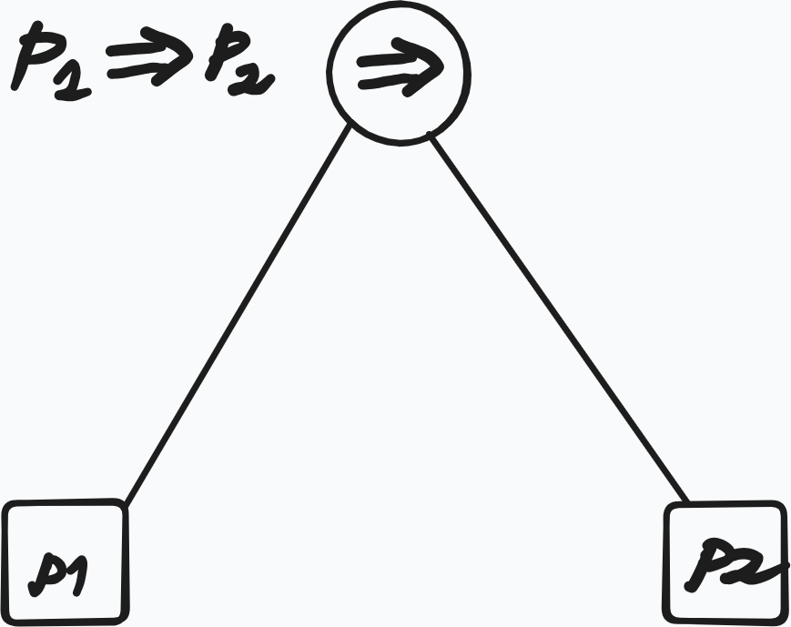
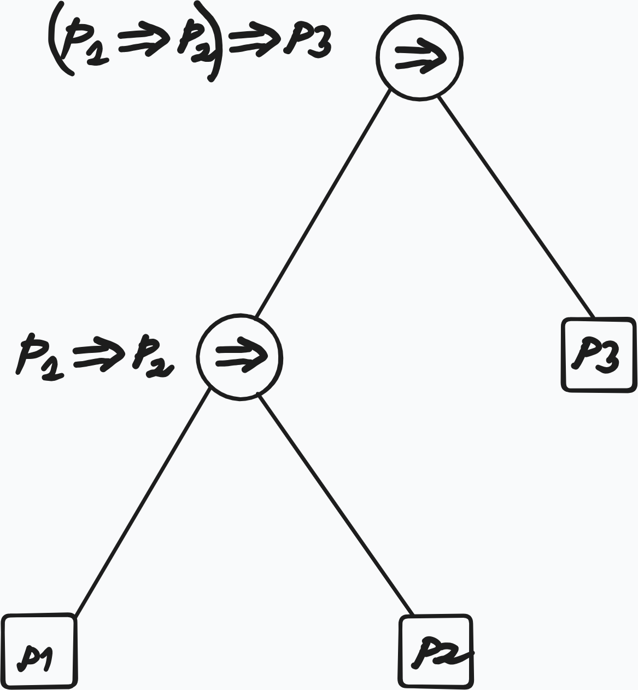
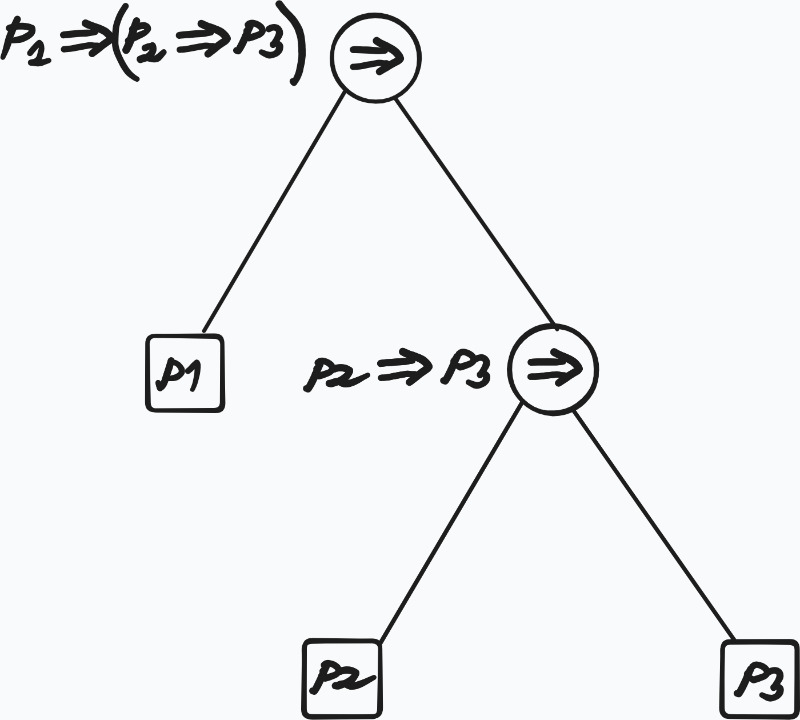

## Overview

Brief summary of what this lecture does (2–4 lines).

**Goal**: Define the expression we can write, these are called **well-formed-formulas**, or **wff**s. 

There are various ways of defining what counts as a wff. One of them is the inductive approach.

## Inductive Approach

First we start with **atomic formulas**: 

$$
\begin{aligned}
&P_0, P_1, P_2, \dots \\
&(P_i)_{i \in \mathbb{N}}
\end{aligned}
$$

are atomic propositions.

We give some rules to inductively define new formulas from old ones.

1) if $\varphi$, $\psi$ are **wff** then $\varphi \Rightarrow \psi$ is a **wff**
1) if $\varphi$, $\psi$ are **wff** then $\varphi \wedge \psi$ is a **wff**
1) if $\varphi$, $\psi$ are **wff** then $\varphi \vee \psi$ is a **wff**
1) if $\varphi$ is a **wff** then $\neg \varphi$ is a **wff**

## Constructor Approach

It is useful to express these rules with **constructors**, which define wffs as values of some functions (with codomain $\mathrm{WFF}$)

In this approach atomic formulas are values of functions:

::: {#def-atomic-formulas-constructor}
## Atomic formulas 

Atomic formulas are values of functions like:

$$
P:\mathbb{N} \to \mathrm{WFF}, \quad :i \mapsto P_i
$$

or

$$
''\cdot'': \mathrm{String} \to \mathrm{WFF}, \quad :x \mapsto "x"
$$

:::

::: {#exm-string-constructor}
## String Constructor

with the latter we can construct arbitrary propositions like:

"today$\sqcup$is$\sqcup$sunny"

:::

We also have constructors for the logical connectives:

::: {#def-logical-connective-constructor}
## Constructors for Logical Connectives

$$
\begin{aligned}
&(\neg):\mathrm{WFF} \to \mathrm{WFF}, \quad :\varphi \mapsto \neg\varphi \\
&(\land) : \mathrm{WFF} \times \mathrm{WFF} \to \mathrm{WFF}, \quad :(\varphi, \psi) \mapsto \varphi \land \psi \\
&(\lor) : \mathrm{WFF} \times \mathrm{WFF} \to \mathrm{WFF}, \quad :(\varphi, \psi) \mapsto \varphi \lor \psi \\
&(\Rightarrow) : \mathrm{WFF} \times \mathrm{WFF} \to \mathrm{WFF}, \quad :(\varphi, \psi) \mapsto \varphi \Rightarrow \psi \\
\end{aligned}
$$

:::

::: {#rem-constructor-vs-inductive-def}
## Constructor vs Symbol View of Logical Connectives

Earlier we wrote $\varphi \Rightarrow \psi$ and then we denoted $\Rightarrow$ symbol as a function of type $\mathrm{WFF} \times \mathrm{WFF} \to \mathrm{WFF}$
, we use $(\Rightarrow)$ to distinguish between the two concepts.

:::

A different but related question that arises si the ambiguity of $P_1 \Rightarrow P_2 \Rightarrow P_3$. According to the inductive definition there are two ways this formula could have been
constructed which corresponds to the different formulas:

1. $(P_1 \Rightarrow P_2) \Rightarrow P_3$ 
2. $P_1 \Rightarrow (P_2 \Rightarrow P_3)$

To resolve this ambiguity we define the associativity rule:

::: {#def-associativity-rule-implication}
## Associativity Rule for $\Rightarrow$

$$
P_1 \Rightarrow P_2 \Rightarrow P_3 := (P_1 \Rightarrow P_2) \Rightarrow P_3 
$$

::: {#rem-wffs-as-trees}
## Wffs as Trees

Wffs can be viewed as trees. Trees encode the derivation structure and resolve the ambiguity

::::{#fig-trees layout-ncol=3}

{width=86%}

{width=86%}

{width=86%}
::::

:::

our collection of wffs can be further enriched   with another binary constructor:

$$
\begin{aligned}
(\Leftrightarrow)&:\mathrm{WFF} \times \mathrm{WFF} \to \mathrm{{WFF}} \\
      &: (\varphi, \psi) \mapsto \varphi \Leftrightarrow \psi
\end{aligned}
$$

::: {#rem-iff-meaning}
## Meaning of $\Leftrightarrow$

At this stage there is no relation between

$$
\varphi \Leftrightarrow \psi \quad \text{and} \quad (\varphi \Rightarrow \psi) \land (\psi \Rightarrow \varphi)
$$

:::

Let is give another 'set-theoretic' approach

## Set Theoretic Approach

First we define the alphabets:

::: {#def-set-theory-approach-pl}
## Set Theoeretic Approach to Defining Wffs

We start with the alphabets:

$$
\begin{aligned}
\mathcal{A} &:= \{P_i\}_{i \in \mathbb{N}} && \text{(sub-alphabet of atomic formulas)} \\
\mathcal{C} &:= \{\Rightarrow, \land, \lor, \neg, \Leftrightarrow\} && \text{(sub-alphabet of logical connectives)} \\
\mathcal{V} &:= \mathcal{A} \cup \mathcal{C} \cup \{(, )\} && \text{(alphabet of propositional logic, including punctuation marks)}
\end{aligned}
$$

:::

Then we define the so-called **Kleene Closure** of $\mathcal{V}$:

::: {#def-kleene-closure-V}
## Kleene Closure of $\mathcal{V}$

$$
\mathcal{V}^* := \bigcup_{i = 0}^\infty \mathcal{V}_{i}
$$

:::

$\mathcal{V}^*$ is the language containing all sorts of strings that can be constructed from the alphabet $\mathcal{V}$, also senseless ones. 

To define the language propositional logic that contains only the formulas that we want and nothing else, we take the usual set-theoretic approach of taking the infinite union
of all sets $\mathcal{W} \subseteq \mathcal{V}$ that satisfy the following properties:

1) $\mathcal{A} \subseteq \mathcal{W}$
2) if $\varphi, \psi \in \mathcal{W}$ then $\varphi \diamond \psi \in \mathcal{W}$, where $\diamond \in \{\Rightarrow, \land, \lor, \Leftrightarrow\}$
3) if $\varphi \in \mathcal{W}$ then $\neg\varphi\in\mathcal{W}$

Then the language of propositinal logic is defined as:

::: {#def-pl-def-set-theoretic-intersection}
## Language Propositional Logic as Infinite Intersection

$$
\mathcal{F}(\mathcal{A}) := \bigcap\{\mathcal{W} \subseteq \mathcal{V}^* | \mathcal{W} \text{ satisfies (1), (2), and (3)}\}
$$

:::

::: {#thm-fa-smallest-set}
<!-- ## $\mathcal{F}(\mathcal{A})$ is smallest -->

With this construction $\mathcal{F}(\mathcal{A})$ is the smallest set that satisfies the properties (1), (2) and (3), i.e.

1) $\mathcal{F}(\mathcal{A})$ satisfies the properties (1), (2) and (3)
2) For any set $\mathcal{W}$ that satisfies the properties (1), (2) and (3) we have $\mathcal{W} \subseteq \mathcal{F}(\mathcal{A})$

:::

## Summary

- WFF is defined inductively  
- Constructors that generate WFFs
- Set theoretic construction of WFFs