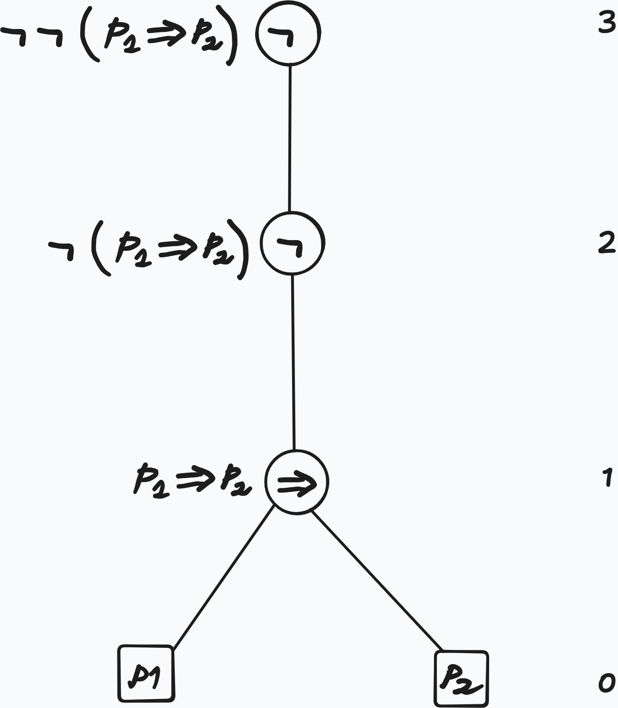

## Overview

- We provide a fourth, iterative set construction for the language of propositional logic.
- We give two equivalent definitions for the height of a formula. 
- We give two equivalent definitions of a function that gives the list of subformulas of a formula

## Recurisve Set Construction

We define $\F{0}$ iteratively as follows:

$$
\begin{aligned}
&\F{0} := \mathcal{A} \\
&\F{1} := \F{0} \cup \Set{\neg\varphi}{\varphi \in \F{0}} \cup \Set{\varphi\diamond\psi}{\varphi,\psi \in \F{0}} &&\text{($\diamond\in\mathcal{C}$)} \\
&\F{n} := \F{n-1} \cup \Set{\neg\varphi}{\varphi \in \F{n-1} \setminus \F{n-2}} \cup \Set{\varphi\diamond\psi}{\varphi, \psi \in \F{n-1}} &&\text{($n\geq 2$)}
\end{aligned}
$$

With this construction it follows that:

$$
\F{n} \subseteq \F{n + 1}
$$

::: {#exm-formulas-in-Fn}

$\neg\neg P_4 \in \F{2} \subseteq \F{3} \subseteq\dots$

but $\neg\neg P_4 \notin \F{1}$, because $\neg{P_4} \notin \F{0}$

:::

Now we make the following definition:

::: {#def-iterative-F}

$$
\mathcal{F} := \bigcup_{n \in \Nat}\F{n}% math here
$$

:::

and we claim:

::: {#lem-equivalence-F-FV}
$$\mathcal{F} = \Fof{\mathcal{A}}$$

:::

Where $\Fof{\mathcal{A}}$ is defined in @def-pl-def-set-theoretic-intersection

::: {.proof}

To prove $\mathcal{F} \subseteq \Fof{\mathcal{A}}$, it suffices to show that 

$$
\F{n} \subseteq \Fof{\mathcal{A}}, \quad \forall n, \, \text{by induction on $n$}
$$

To conclude the proof we need to show that $\F{A} \subseteq \mathcal{F}$

:::

::: {#def-height-formula-set}
## Height of Formula - Set Approach

For all $\varphi\in\mathcal{F}$, there is a well defined natural number $\ht{\varphi}\in\Nat$:

$$
\ht{\varphi} := \mathrm{min}\Set{n\in\Nat}{\varphi\in\F{n}}
$$

called the **height** of $\varphi$

:::

We give another, a more computational definition for the height.

::: {#def-height-formula-computational}
## Height of a Formula - Computational Approach

We define $\ht{\cdot}$ recursively on the structure of a formula $\phi$ as follows:

$$
\begin{aligned}
&\ht{P_i} = 0 &&\text{($P_i\in \mathcal{A}$)}\\
&\ht{\neg\varphi} = 1 + \ht{\varphi} \\
&\ht{\varphi\diamond\psi} = 1 + \mathrm{max}(\ht{\varphi}, \ht{\psi}) &&\text{($\diamond\in\mathcal{C}$)}
\end{aligned}
$$

:::

::: {#rem-pattern-matching}
## Pattern Matching

Such inductive (recursive) definitions are also called **pattern matching**

:::

::: {#exm-height-derivation}
## Derivation of Height

$$
\begin{aligned}
\ht{\neg\neg(P_1 \Rightarrow P_2)} &= 1 + \ht{\neg(P_1 \Rightarrow P_2)} \\
                                   &= 1 + 1 + \ht{P_1 \Rightarrow P_2} \\
                                   &= 1 + 1 + \mathrm{max}(\ht{P_1}, \ht{P_2}) \\
                                   &= 1 + 1 + \mathrm{max}(1, 1) \\
                                   &= 1 + 1 + 1 \\
                                   &= 3
\end{aligned}
$$

:::

**Obervation**: 

We observe that the height of a formula is the height of its syntax tree

{width="50%"}

We want to define a function

$$
\mathrm{sf}: \Fof{\mathcal{A}} \to \mathcal{P}(\Fof{\mathcal{A}})
$$

mapping a formula to its set of subformulas. For this we are going to define functions $\sf{i}: \F{i} \to \Pow{\mathcal{F}}$ as follows:

::: {#def-sf-set-construction}
## Set Construction of $\mathrm{sf}$

$$
\begin{aligned}
&\sf{0}(P_i) := \{P_i\} \\
&\sf{n}(\neg\varphi) := \{\neg\varphi\} \cup \sf{n-1}(\varphi) \\
&\sf{n}(\varphi\diamond\psi) := \{\varphi\diamond\psi\} \cup \sf{n-1}(\varphi) \cup \sf{n-1}(\psi)
\end{aligned}
$$

Then $\mathrm{sf}$ can be defined as 

$$
\begin{aligned}
\mathrm{sf}&:\mathcal{F} \to \Pow{\mathcal{F}} \\
           &:\varphi\mapsto\sf{\ht{\varphi}}(\varphi)
\end{aligned}
$$

:::

We give another, more computational approach, by defining $\mathrm{sf}$ recursively on the structure of wffs as a function $\mathrm{sf}:\WFF \to [\WFF]$

::: {#def-sf-list-construction}
## List Construction of $\mathrm{sf}$

$$
\begin{aligned}
&\mathrm{sf}(P_i) := [P_i] \\
&\mathrm{sf}(\neg\varphi) := [\neg\varphi] \concat \mathrm{sf}(\varphi) \\
&\mathrm{sf}(\varphi\diamond\psi):= [\varphi\diamond\psi] \concat \mathrm{sf}(\varphi) \concat \mathrm{sf}(\psi)
\end{aligned}
$$

::: {#exm-sf-list-derivation}
## Derivation of the List of Subformulas with $\mathrm{sf}$

$$
\begin{aligned}
\sfn{P_1 \lor \neg P_2} &= [P_1 \lor \neg P_2] \concat \sfn{P_1} \concat \sfn{\neg P_2} \\
                        &= [P_1 \lor \neg P_2] \concat [P_1] \concat [\neg P_2] \concat \sfn{P_2} \\
                        &= [P_1 \lor \neg P_2] \concat [P_1] \concat [\neg P_2] \concat [P_2] \\
                        &= [P_1 \lor \neg P_2, P_1, \neg P_2, P_2]
\end{aligned}
$$

:::

## Summary

- iterative set construction $\F{i}$ - the language of propositional logic as infinite union of such
- two definitions for $\mathrm{ht}$ - height of a formula
- two definitions for $\mathrm{sf}$ - list or set of subformulas of a formula